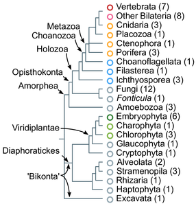
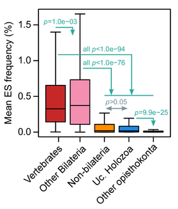
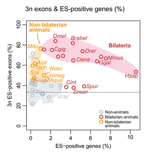
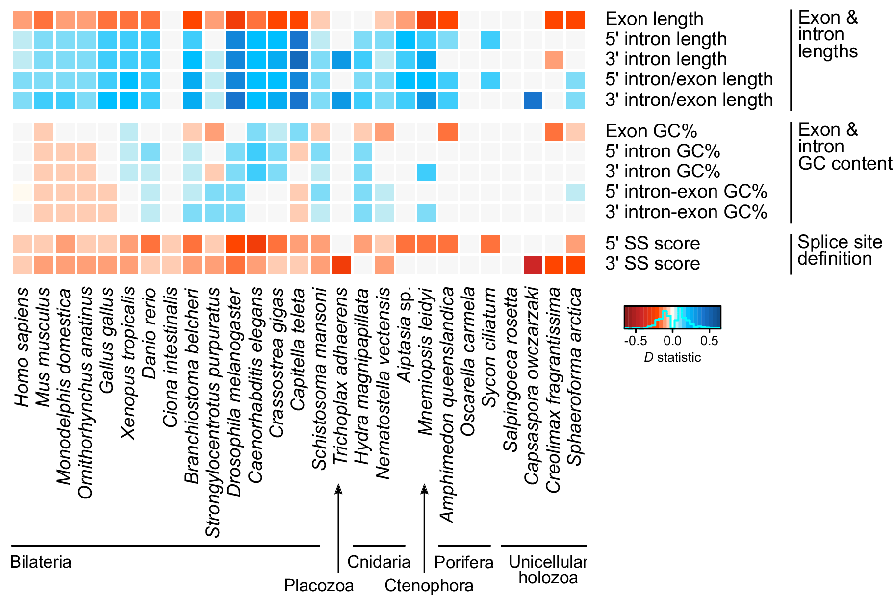
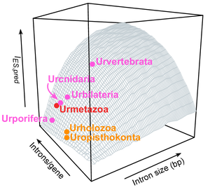
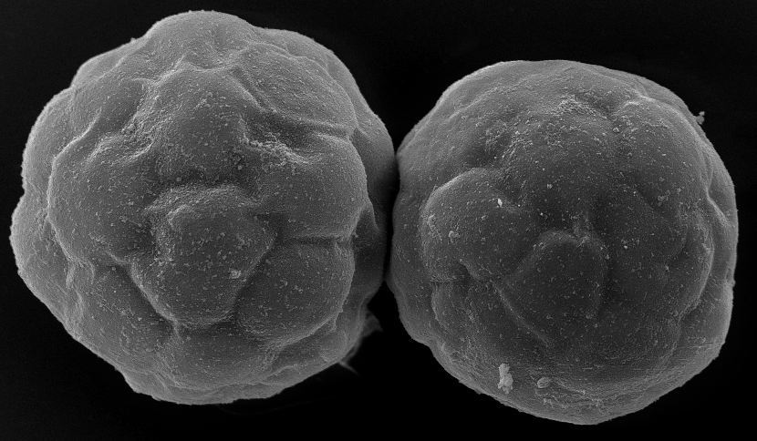

After a few years of work with [Iñaki Ruiz-Trillo](http://multicellgenome.com/){:target="_blank"} (IBE and ICREA) and [Manuel Irimia](https://www.crg.eu/en/group-members/manuel-irimia){:target="_blank"} (CRG), the last paper from my PhD thesis has just been published in Genome Biology — you can read it here (open access, of course).

> [Origin of exon skipping-rich transcriptomes in animals driven by evolution of gene architecture](https://genomebiology.biomedcentral.com/articles/10.1186/s13059-018-1499-9){:target="_blank"} (Grau-Bové et al., Genome Biology 2018)

In this article, we survey the role of alternative splicing in the transcriptomes of 65 different eukaryotes. **Alternative splicing is a mechanism of transcriptomic regulation by which multiple transcripts (isoforms) can be produced from a single gene**. Some of these ‘additional’ possible transcripts can end up becoming new evolutionarily significant protein variants, but AS also affects gene expression levels, and has been linked to a fairly substantial amount of biological noise.

In any case, AS bears the potential to increase the biological complexity of eukaryotes by tuning the usage and function of the genes encoded in their genomes (provided they have introns, as many eukaryotic genes do).

We took a great effort in covering as much eukaryotic diversity as possible, in order to make evolutionary inferences all the more robust. To the best of our knowledge, this is the first comparative of alternative splicing that includes at least one genome from each of the main eukaryotic groups, and covers all available early-branching animals.

|  |
|:--:|
| Our taxon sampling.|

For the most part, we focus on a particular form of AS known as exon skipping (ES): the alternative inclusion of a given exon in the final transcript. Exon skipping has long been considered a fixture of animal transcriptomes (and maybe even one of the reasons behind animal multicellular complexity). Of course, we wanted to dig deeper into this idea.

First things first: all eukaryotic groups show at least some level of exon skipping, which means that it appeared in the last eukaryotic common ancestor (at the same time introns did).

Second, we indeed found that animals had generally higher levels of exon skipping than other eukaryotes (in the figure below, we compare frequencies in animal groups, unicellular holozoans, and other opisthokonts like fungi). But this was not the case for all animals: early-branching non-bilaterians, like sponges or the placozoan Trichoplax adhaerens had low, ‘protist-like’ ES levels.

|  |
|:--:|
| ES frequency in animals and some unicellular eukaryotic groups. Non-bilaterians include sponges, cnidarians, Mnemiopsis (ctenophore) and Trichoplax (placozoan). |

Does that mean that the great increase in exon skipping usage seen in animals was actually something specific to bilaterians alone? Quantitatively, it may seem so. Qualitatively, not quite so.

Indeed, even if they had fairly low exon skipping, early-branching sponges and *Trichoplax* shared a unique feature with most other animals: skipped exons tended to have 3-divisible lengths, which means that their occasional exclusion has a lesser effect on the final transcript and protein (it does not break the ORF):

|  |
|:--:|
| In most bilaterians (red), higher ES implies an overabundance of ORF-preserving alternative splicing events. |

This means that exon skipping in early animals became enriched for frame-preserving events (with 3-divisible exon lengths) before the increase in exon skipping in bilaterian animals. We see this as a two-step evolutionary process.

So far, this is the first part of the paper. But this analysis came with a surprise: when comparing exon skipping in different eukaryotes, we saw that some protists, like Sphaeroforma arctica, had small increases in frequency compared to their sister species. Interestingly, this coincided with **protists that had some ‘animal-like’ features in their genome architectures**, like enlarged genomes with abundant and long introns.

The relationship between gene architecture and alternative splicing frequency is well-known and proved in a number of species. But *Sphaeroforma*‘s oddity raised a question: are gene architectural effects on AS ‘universal’ to all eukaryotes? And, if so, can we use them to understand the evolution of alternative splicing?

Well, as it turns out, yes.

In this figure, we show that whenever a given trait of gene architecture is associated with exon skipping, this correlation tends to be conserved across multiple eukaryotes. For example, having longer introns facilitates skipping of the middle exon, and this can be seen in most species (blue boxes all along the horizontal axis). Same thing for negative relationships (in red): e.g. short exons are more frequently involved in skipping.

|  |
|:--:|
| Positive (blue) and negative (red) associations of various gene architectural features with higher ES levels, for some holozoans. All 65 species are shown in the paper. |

Thus, *Sphaeroforma*‘s increase in exon skipping is mirrored by changes in its genome organization that facilitate this form alternative splicing. These same changes occurred independently (and more deeply) in animals and plants.

In essence, we find that gene architecture is a pan-eukaryotic ‘soft code’ of alternative splicing determination. Thus, we **can approximate the evolution of this part of the transcriptome by studying the evolutionary history of genomes**. And genome evolution is way easier to study.

And this is our final throw of perfume to the violet: we use data from gene architecture and AS in living eukaryotes to approximate the levels of AS in ancestral eukaryotes, for which transcriptomic data is obviously non-existing. We use this model to pinpoint shifts in AS usage in the animal ancestry.

|  |
|:--:|
| Climbing mount AS using genome data as a GPS. A terrible metaphor, but I like the plot |

This ancestral reconstruction signals that **animal evolutionary innovations involving AS mostly appeared at the same time as multicellular animals** (quite unlike what happens for other genome innovations, like many quintessential ‘animal’ gene families that are actually older than one might expect — see here, and here, and here, and here…).

And that is it.

In the paper we cover other topics as well, such as intron retention, the effect of nucleotide composition in AS, a more detailed analysis of intron length evolution in Volvox and Sphaeroforma, and more. To find out about that, I encourage you to read it 😉

And if you have any input or doubts, let me know!

|  |
|:--:|
| *Sphaeroforma arctica*, by Arnau Sebé-Pedrós. |

PS: It’s also been argued that AS is not a central contributor to ‘regulated proteome diversity’ after all. Instead, it’d be a consequence of a substantial amount of ‘noisy splicing’, and most genes would actually be producing just one main isoform. I personally think this idea has merit at the micro-evolutionary level, although our macro-evolutionary analysis is forcefully recovering more signal from long-standing adaptive effects. This is a very interesting read in that respect:

> [Alternative Splicing May Not Be the Key to Proteome Complexity](https://www.ncbi.nlm.nih.gov/pmc/articles/pmid/27712956/) (Tress et al., Trends in Biochemical Sciences 2016).
